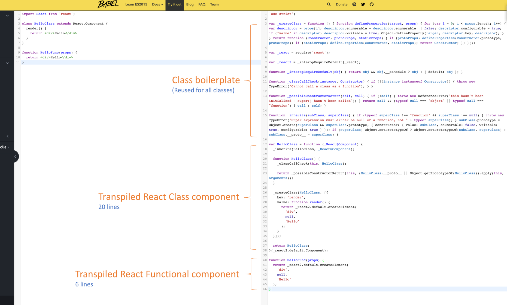

import { Image, Notes } from 'mdx-deck'
import { Invert } from 'mdx-deck/layouts'
import {CodeSurfer } from "mdx-deck-code-surfer"
import nightOwl from "prism-react-renderer/themes/nightOwl"
export { default as theme } from './theme'

import  PriceTicker  from 'components/PriceTicker/PriceTicker'
import  PriceTickerCompound  from 'components/PriceTicker/PriceTickerCompound'
import  PriceTickerWithDarkThemeHOC  from 'components/PriceTicker/PriceTickerHOC'
import  PriceTickerWithDarkThemeRenderProps  from 'components/PriceTicker/PriceTickerRenderProps'

# React Component Patterns FTW

### Sam Lindstrom

---

# Some background

<Notes>
  - Saw OSS maintainers and coworkers using interesting patterns
    <br/>
  - Wanted to level up my React 
</Notes>

---

# Why Should We Care?

---

  ## Design Patterns Help Combat:
  - ill-defined project requirements 
  - constant design changes 
  - poorly documented code

---

<CodeSurfer 
  code={require("raw-loader!./snippets/first.snippet")}
  theme={nightOwl}
  showNumbers
/>

---

# React Component API
- render
- state
- props
- context
- lifecycle events


<Notes>
  - examples are contrived and in some cases, impractical
    <br/>
  - the goal is to illustrate interaction between components 
    <br/>
  - and to hopefully inspire greater curiousity on these patterns
</Notes>

---

# Stateful Component

---
<CodeSurfer 
  code={require("raw-loader!./snippets/stateful.snippet")}
  title="Stateful Component"
  theme={nightOwl}
  showNumbers
  steps={[
    { notes: ''},
    { range: [5,11]},
    { range: [14,20]}
  ]}
/>

---

export default Invert

<PriceTicker />

---

export default Invert

## Stateful Component

### Advantages
- Easy to manage component state
- Standard technique with ample documentation
- ES6 classes

### Disadvantages
- Can be more complexity than we need
- Not all components need to manage state
- ES6 classes

---

# Stateless Functional Component

---

<CodeSurfer 
  code={require("raw-loader!./snippets/sfc.snippet")}
  title="Stateless Functional Component (SFC)"
  theme={nightOwl}
  showNumbers
/>

---

export default Invert

## Stateless Functional

### Advantages
 - simplicity
 - enforces pure function practices (zero side effects)
 - easy to test
 - eliminates ES6 class related boilerplate (constructor(), extends, etc)
 - no 'this' keyword

### Disadvantages
  - design inconsistencies
  - conversion hassle
  - can't I just use a PureComponent?

<Notes>
  React.PureComponent is similar to React.Component. 
    <br/>
  The difference between them is that Component doesn’t implement shouldComponentUpdate(), 
  but PureComponent implements it with a shallow prop and state comparison.
    <br/>
  - ^helps to avoid unnecessary re-renders
</Notes>
---

<a target="_blank" href="https://hackernoon.com/react-stateless-functional-components-nine-wins-you-might-have-overlooked-997b0d933dbc">
  
</a>

###### Source: [Cory House's React Stateless Functional Components 9 Wins You Might Have Overlooked](https://hackernoon.com/react-stateless-functional-components-nine-wins-you-might-have-overlooked-997b0d933dbc)

<Notes>
  Source: Cory House's Hacker Noon Blog Post on SFC's: <br/> https://hackernoon.com/react-stateless-functional-components-nine-wins-you-might-have-overlooked-997b0d933dbc
</Notes>


---

# Container vs. Presentational Components

---

<CodeSurfer 
  code={require("raw-loader!./snippets/p&c.snippet")}
  title="Presentational + Container"
  theme={nightOwl}
  showNumbers
  steps={[
    { notes: ''},
    { range: [1,7]},
    { range: [9,48]},
    { notes: ''},
  ]}
/>

---

# Stakeholder Demands

 *"We want to allow users to refresh prices whenever they'd like"*

---

# Compound Components

---

 ## Inversion of control

<Notes>
  - Great for handling rendering logic
    <br/>
  - Manages state within itself thereby abstracting away some complexity
</Notes>

---

<CodeSurfer 
  code={require("raw-loader!./snippets/compound.snippet")}
  title="Implementation"
  theme={nightOwl}
  showNumbers
  steps={[
    { notes: ''},
    { range: [5,15]},
    { range: [38,49]},
    { notes: ''},
  ]}
/>

<Notes>
  - Consider for a moment some of your own code. Do you have a React component that keeps getting new rendering options?
    <br/>
  - Ryan Florence has a great talk on this though he doesn't use static properties
    <br/>
  - His workshop begins tomorrow
</Notes>

---

## Building a Compound Component

- static properties
- React.Children.Map
- React.cloneElement

<Notes>
  - `static`  (ES6) defines static methods on a class. Included by default in CRA
</Notes>

---

<CodeSurfer 
  code={require("raw-loader!./snippets/compound-usage.snippet")}
  title="Usage"
  theme={nightOwl}
  showNumbers
/>

---

export default Invert

<PriceTickerCompound>
  <PriceTickerCompound.Button>Update</PriceTickerCompound.Button>
  <PriceTickerCompound.Row currency="BTC" />
  <PriceTickerCompound.Row currency="ETH" />
</PriceTickerCompound>

---

export default Invert

## Compound Component

<br/>

### Advantages
 - inverts rendering control to your user
 - flexible to change
 - great for code sharing and reuse

<br/>

### Disadvantages
  - can't access nested children (without the Context API) 
  - can lead to bloated render() methods

<Notes>
  - Can be combined with the new React Context API to pass state to deeply nested children
</Notes>

---

# Stakeholder Demands

 *"We want dark mode"*

---

# Higher Order Component

<Notes>
  - Common in 3rd party libraries
  <br/>
  - Remember: A standard component transforms props into UI
  <br/>
  - a higher-order component transforms a component into another component
</Notes>

---

## Higher Order Function:

*A higher order function is a function that takes and/or returns a function*

<Notes>
  - Just a generic container, wrapped up in a function
</Notes>

---

### Higher Order Function:

Allows for more declarative code

---

### Higher Order Function:
* `Array.map()`
* `Array.filter()`
* `Array.reduce()`

---

<CodeSurfer 
  code={require("raw-loader!./snippets/hoc.snippet")}
  title="Implementation"
  theme={nightOwl}
  showNumbers
/>

---

```jsx
const PriceTickerWithDarkThemeHOC = withDarkThemeToggle(PriceTicker)

<PriceTickerWithDarkThemeHOC />
```

---

export default Invert

<PriceTickerWithDarkThemeHOC />

---

export default Invert

## Higher Order Component (HOC)

### Advantages
- allows for more composable code
- is a pure function with zero side effects
- leads to greater separation of concerns

### Disadvantages
- prop obfuscation: where did this prop come from?
- static composition
- wrapping components overrides static methods of the original component

<Notes>
  -Regarding refs: https://reactjs.org/docs/higher-order-components.html#refs-arent-passed-through
</Notes>

---

# Render Props 
## (or Render Callback)
## (or Children as a Function)

---

## Traditional Rendering of Child Components

```jsx
const Parent = (props) => {
  return (
    <div>
      { props.children }
    </div>
  )
}
```
```jsx
<Parent>
  <Child />
</Parent>
```

---

## Rendering of Child Components via Render Prop

```jsx
  const Parent = (props) => {
    return (
      <div>
        { props.render() }
      </div>
    )
  }
```
```jsx
<Parent render={(name = "React Denver") => '<h1>Hi ${name}!</h1>'} />
```

---

# Understanding JSX

---

## Remember:
## JSX is just a function call

<br/>

```js
React.createElement(
  type,
  [props],
  [...children]
)
```

---

### In JSX, curly braces indicate an argument to React.createElement()

---

<a href="https://babeljs.io/repl/#?babili=false&browsers=&build=&builtIns=false&spec=false&loose=false&code_lz=MYewdgzgLgBAFgUwDZJDAvDAFABwE4g4QCUGAfDAN4BQMMeCUArnmDADwAmAlgG5kAJZKhgB3EHiScAhDACyATxhgAhgFsEMbhCr5CEAHSqNAX3YB6HvwDc1E9SA&debug=false&forceAllTransforms=false&shippedProposals=false&circleciRepo=&evaluate=false&fileSize=false&timeTravel=false&sourceType=module&lineWrap=true&presets=react&prettier=false&targets=&version=6.26.0&envVersion=" target="_blank">See Babel</a>
<br/>
<a href="https://babeljs.io/repl/#?babili=false&browsers=&build=&builtIns=false&spec=false&loose=false&code_lz=MYGwhgzhAEASCmIQHsCy8pgOb2vAHgC7wB2AJjAErxjCEB0AwsgLYAOyJph0A3gFDRoAJ1Jl4wgBQBKPoKEj4hAK7CS0SfIXQAPGQCWANwB8W7XEQpoAd2TCQZAITRUAT2gkwLXPpi9CABa-9GzCyGwQ9J7eAL5mQjoA9AYmZtLycXH8iYnQ1OQS0AAKYRH8wJwQPCX6wPAAKrUA1hIA6vqBACJgwk31AfDe-eLCJeEwALwashPGGvI67V09fQPe9chYWCDwxrwy0LO6NXWNwC3C0InGMUlLAd29_YMNm9u7_OlAA&debug=false&forceAllTransforms=false&shippedProposals=false&circleciRepo=&evaluate=false&fileSize=false&timeTravel=false&sourceType=module&lineWrap=true&presets=react&prettier=false&targets=&version=6.26.0&envVersion=" target="_blank">
  More Examples
</a>

---

<CodeSurfer 
  code={require("raw-loader!./snippets/render-props.snippet")}
  title="Implementation"
  theme={nightOwl}
  showNumbers
    steps={[
    { notes: ''},
    { range: [4,28]},
    { range: [72,74]}
  ]}
/>

---
export default Invert

<PriceTickerWithDarkThemeRenderProps />

---

export default Invert

## Render Props

### Advantages
- very flexible
- unopinionated
- reduce naming collisions
- dynamic composition (composing inside render())

### Disadvantages
- nesting can lead to hideous render() methods
- can be difficult to test

---

# The Future of Render Props

---

## More Resources

<Notes>
  - the React docs
    <br/>
  - Kent C. Dodds Advanced React Patterns Course (FrontEnd Masters and Egghead)
    <br/>
  - Talks from Michael Jackson and Ryan Florence
</Notes>

---

export default Invert


<Notes>
  - We're Hiring
    <br/>
  - Node, Haskell, React, Rust
    <br/>
  - There are a few of us here so come talk to me or find someone in a SALT shirt
</Notes>

---

# Thanks
